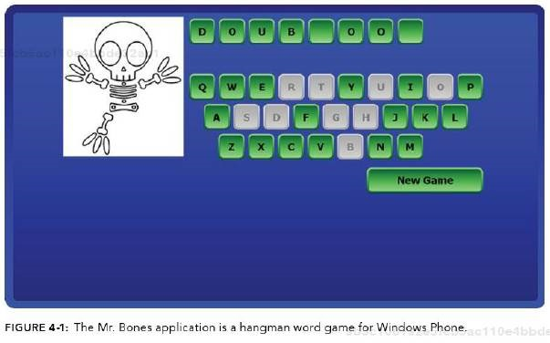

# HW Assignment #1

### Problem 1.1
> What are the basic tasks that all software engineering projects must handle?

Answer

### Problem 1.2
> Give a one sentence description of each of the tasks you listed in Exercise 1.

Answer

### Problem 2.4
> Like Microsoft Word, Google Docs [sic] provides some simple change tracking tools. Go to http://www.google.com/docs/about/ to learn more and sign up [if you do not have an account already]. Then create a document, save it, close it, reopen it, and make changes to it as you did in Exercise 1.

I did it

### Problem 2.5
> What does JBGE stand for and what does it mean?

Answer

> Use the following table of data for Exercises 3.2 and 3.4.

| Task | Time (Days) | Predecessors |
| --- | --- | --- |
| A. Robotic control module | 	5	| — |
| B. Texture library | 	5	| C |
| C. Texture editor | 	4	| — |
| D. Character editor | 	6	| A, G, I |
| E. Character animator | 	7	| D |
| F. Artificial intelligence (for zombies) | 	7	| — |
| G. Rendering engine | 	6	| — |
| H. Humanoid base classes | 	3	| — |
| I. Character classes | 	3	| H |
| J. Zombie classes | 	3	| H |
| K. Test environment | 	5	| L |
| L. Test environment editor | 	6	| C, G |
| M. Character library | 	9	| B, E, I |
| N. Zombie library	 | 15	| B, J, O |
| O. Zombie editor | 	5	| A, G, J |
| P. Zombie animator | 	6	| O |
| Q. Character testing | 	4	| K, M |
| R. Zombie testing | 	4	| K, N |

### Problem 3.2
> Use critical path methods to find the total expected time from the project's start for each task's completion. Find the critical path. What are the tasks on the critical path? What is the total expected duration of the project in working days?

Answer

### Problem 3.4
> Build a Gantt chart for the network you drew in Exercise 3. [Yes, I know, you weren't assigned that one — however, when you do Exercise 2 you should have enough information for this one.] Start on Wednesday, January 1, 2020, and don't work on weekends or the following holidays:

| Holiday | Date |
| --- | --- |
| New Year's Day	| January 1 |
| Martin Luther King Day	| January 20 |
| President's Day	| February 17 |

### Problem 3.6
> In addition to losing time from vacation and sick leave, projects can suffer from problems that just strike out of nowhere. Sort of a bad version of deus ex machina. For example, senior management could decide to switch your target platform from Windows desktop PSs to the latest smartwatch technology. Or a strike in the Far East could delay the shipment of your new servers. Or one of your developers might move to Iceland. How can you handle these sorts of completely unpredictable problems?

Answer

### Problem 3.8
> What are the two biggest mistakes you can make while tracking tasks?

Answer

### Problem 4.1
> List five characteristics of good requirements.

Answer

### Problem 4.3
> Suppose you want to build a program called TimeShifter to upload and download files at scheduled times while you're on vacation. The following list shows some of the applications requirements.

1. Allow users to monitor uploads/downloads while away from the office.
1. Let the user specify website log-in parameters such as an Internet address, a port, a username, and a password.
1. Let the user specify upload/download parameters such a number of retries if there's a problem.
1. Let the user select an Internet location, a local file, and a time to perform the upload/download.
1. Let the user schedule uploads/downloads at any time.
1. Allow uploads/downloads to run at any time.
1. Make uploads/downloads transfer at least 8 Mbps.
1. Run uploads/downloads sequentially. Two cannot run at the same time.
1. If an upload/download is scheduled for a time whan another is in progress, it waits until the other one finishes.
1. Perform schedule uploads/downloads.
1. Keep a log of all attempted uploads/downloads and whether the succeeded.
1. Let the user empty the log.
1. Display reports of upoad/download attempts.
1. Let the user view the log reports on a remote device such as a phone.
1. Send an e-mail to an administrator if an upload/download fails more than its maximum retry number of times.
1. Send a text message to an administrator if an upload/download fails more than it's maximum retury umber of times.

> For this exercise, list the audience-oriented categories for each requirement. Are there requirements in each category? [If not, state why not…]

Answer

### Problem 4.9

>
Figure 4-1 shows the design for a simple hangman game that will run on smartphones. When you click the New Bame button, the program picks a random mystery word from a large list and starts a new game. Then if you click a letter, either the letter is filled in where it appears in the mystery word, or a new piece of Mr. Bones's skeleton appears. In either case, the letter you clicked is grayed out so that you don't pick it again. If you guess all the letters in the mystery word, the game displays a message that says, "Contratulations, you won!" If you build Mr. Bones's complete skeleton, a message says, "Sorry, you lost."

> Brainstorm this application and see if you can think of ways you might change it. Use the MOSCOW method to prioritize your changes.

Answer
